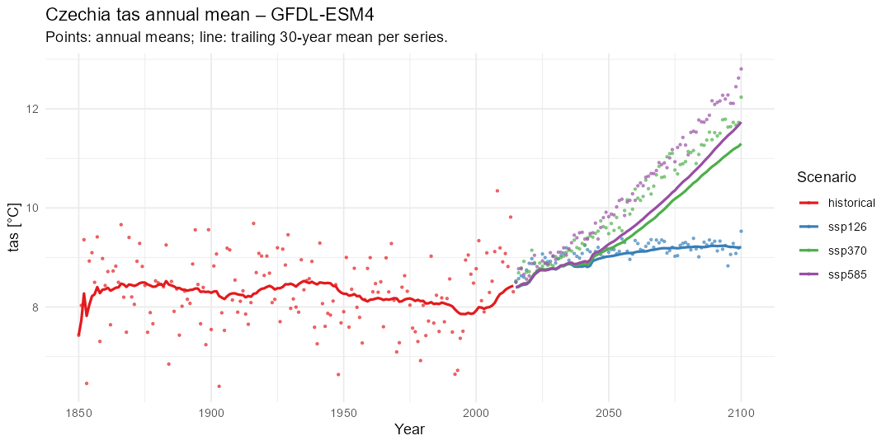
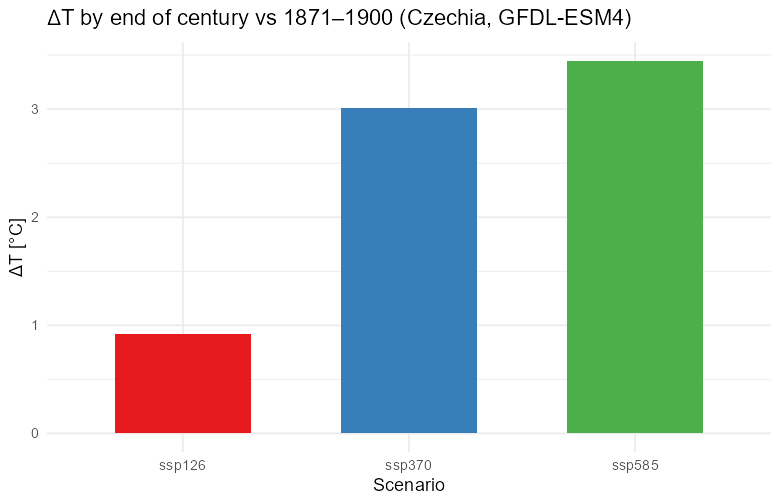

# Czechia tas – GFDL-ESM4 delta T report

 Baseline (1871–1900) mean tas:  8.29 °C 

 ## Delta T by scenario (2071–2100 vs 1871–1900)
 - ssp126: ΔT = 0.92 °C (2071–2100 vs 1871–1900)
- ssp370: ΔT = 3.01 °C (2071–2100 vs 1871–1900)
- ssp585: ΔT = 3.45 °C (2071–2100 vs 1871–1900) 

 ## Figures

 

 

 Generated by Rolling30.R

## Appendix: processing script

```r
# Load libraries
if (requireNamespace("terra", quietly = TRUE)) {
  library(terra)
} else {
  message("Package 'terra' not installed; gridded operations will be skipped.")
}

if ("package:terra" %in% search()) {
  terraOptions(todisk = TRUE, memfrac = 0.6, progress = 1)
}

# Required packages for this script
req <- c("ncdf4","dplyr","lubridate","zoo","ggplot2","here")
miss <- req[!vapply(req, requireNamespace, logical(1), quietly = TRUE)]
if (length(miss)) {
  stop(sprintf(
    "Missing packages: %s. Install once in your R session: install.packages(c(%s))",
    paste(miss, collapse = ", "), paste(sprintf('\"%s\"', miss), collapse = ", ")
  ), call. = FALSE)
}

library(ncdf4)
library(ggplot2)
library(dplyr)
library(lubridate)
library(zoo)
library(here)

# --- memory-safe loaders -----------------------------------------------

# Time-series NetCDF reader
read_series <- function(path, var = "tas", out_unit = "C") {
  stopifnot(file.exists(path))
  nc <- ncdf4::nc_open(path); on.exit(ncdf4::nc_close(nc))

  # time vector
  t <- ncdf4::ncvar_get(nc, "time")
  tu <- ncdf4::ncatt_get(nc, "time", "units")$value
  origin <- as.Date(sub("^.*since\\s+", "", tu))
  date <- origin + as.numeric(t)
  nt <- length(date)

  # choose variable
  vnames <- names(nc$var)
  vname <- if (var %in% vnames) var else {
    cand <- vnames[grepl("^tas$|tas", vnames, ignore.case = TRUE)]
    if (length(cand)) cand[[1]] else stop("Variable not found: ", var)
  }
  v <- nc$var[[vname]]
  dims <- v$dim
  dnames <- vapply(dims, function(d) d$name, character(1))
  dsize  <- vapply(dims, function(d) d$len, numeric(1))

  # unit conversion to Celsius
  conv_units_safe <- function(y) {
    vu <- tryCatch(ncdf4::ncatt_get(nc, vname, "units")$value, error = function(e) NA_character_)
    if (!is.na(vu) && !is.null(out_unit) && toupper(out_unit) == "C" && tolower(vu) %in% c("k", "kelvin")) {
      y <- y - 273.15; vu <- "C"
    } else if (is.na(vu) || vu == "") {
      medv <- suppressWarnings(stats::median(y, na.rm = TRUE))
      if (is.finite(medv) && medv > 150) { y <- y - 273.15; vu <- "C" }
    }
    list(y = y, unit = vu)
  }

  # 1D over time
  if (length(dsize) == 1 || (length(dsize) == 2 && any(dnames == "time") && prod(dsize[dnames != "time"]) == 1)) {
    y <- as.numeric(ncdf4::ncvar_get(nc, vname))
    cu <- conv_units_safe(y); y <- cu$y; vu <- cu$unit
    return(data.frame(date = date, tas = y, unit = vu))
  }

  # 3D with time
  if (length(dsize) == 3 && any(dnames == "time")) {
    # Arrange order as [x, y, time]
    tidx <- which(dnames == "time")
    other <- setdiff(seq_along(dsize), tidx)
    nx <- dsize[other[1]]; ny <- dsize[other[2]]
    y <- numeric(nt)
    # stream one slice at a time
    for (i in seq_len(nt)) {
      start <- c(1, 1, 1)
      count <- c(1, 1, 1)
      start[other] <- c(1, 1)
      count[other] <- c(nx, ny)
      start[tidx] <- i
      count[tidx] <- 1
      sli <- ncdf4::ncvar_get(nc, vname, start = start, count = count)
      y[i] <- mean(sli, na.rm = TRUE)
      if ((i %% 1000) == 0) message("read_series: processed ", i, "/", nt)
    }
    cu <- conv_units_safe(y); y <- cu$y; vu <- cu$unit
    return(data.frame(date = date, tas = y, unit = vu))
  }

  stop("Unsupported variable dimensionality for ", vname, ": ", paste(dnames, collapse = ", "))
}

# Gridded NetCDF
load_gridded <- function(dir) {
  files <- list.files(dir, pattern = "^tas_day_.*_gr1_.*\\.nc$", full.names = TRUE)
  if (!length(files)) stop(sprintf("No gridded files found in %s", dir), call. = FALSE)
  terra::rast(files)
}

#  global summaries
safe_range <- function(x) terra::global(x, range, na.rm = TRUE)

# Extract a single time slice 
safe_slice <- function(x, i, filename = NULL) {
  s <- x[[i]]
  if (!is.null(filename)) {
    writeRaster(s, filename, overwrite = TRUE)
    return(filename)
  }
  s
}

# Load data
message("Working directory: ", getwd())
data_dir <- here("DATA")
message("Data dir resolved by here(): ", data_dir)
hist_data_path <- file.path(data_dir, "ismip/all_tas_cze_1850_2014.nc")
ssp_126_path  <- file.path(data_dir, "SSP126/all_SSP126_2015_2100.nc")
ssp_370_path  <- file.path(data_dir, "SSP370/all_SSP370_2015_2100.nc")
ssp_585_path  <- file.path(data_dir, "SSP585/all_SSP585_2015_2100.nc")

# Load aggregated historical time-series 
stopifnot(file.exists(hist_data_path))
hist_ts   <- read_series(hist_data_path)

# load SSPs
stopifnot(file.exists(ssp_126_path), file.exists(ssp_370_path), file.exists(ssp_585_path))
ssp126_ts <- read_series(ssp_126_path)
ssp370_ts <- read_series(ssp_370_path)
ssp585_ts <- read_series(ssp_585_path)

# Align SSP series to historical 
align_ssp_to_hist <- function(ssp_ts, hist_ts, hist_years = 1995:2014, ssp_years = 2015:2029, tol = 1.5) {
  hx <- hist_ts |>
    dplyr::mutate(year = lubridate::year(date)) |>
    dplyr::filter(year %in% hist_years) |>
    dplyr::summarise(mu = mean(tas, na.rm = TRUE)) |>
    dplyr::pull(mu)
  sx <- ssp_ts |>
    dplyr::mutate(year = lubridate::year(date)) |>
    dplyr::filter(year %in% ssp_years) |>
    dplyr::summarise(mu = mean(tas, na.rm = TRUE)) |>
    dplyr::pull(mu)
  if (length(hx) == 1 && length(sx) == 1 && is.finite(hx) && is.finite(sx)) {
    gap <- hx - sx
    if (is.finite(gap) && abs(gap) > tol) {
      ssp_ts$tas <- ssp_ts$tas + gap
    }
  }
  ssp_ts
}

ssp126_ts <- align_ssp_to_hist(ssp126_ts, hist_ts)
ssp370_ts <- align_ssp_to_hist(ssp370_ts, hist_ts)
ssp585_ts <- align_ssp_to_hist(ssp585_ts, hist_ts)

# 30-day rolling mean 
hist_ts$roll30 <- zoo::rollapply(hist_ts$tas, 30, mean, align = "right", fill = NA)

# Combine into one Czechia tas series (1850-2100)
ts_all <- dplyr::bind_rows(
  dplyr::mutate(hist_ts,  scenario = "historical"),
  dplyr::mutate(ssp126_ts, scenario = "ssp126"),
  dplyr::mutate(ssp370_ts, scenario = "ssp370"),
  dplyr::mutate(ssp585_ts, scenario = "ssp585")
) |>
  dplyr::arrange(date)

# Save CSV and quick plot
out_dir <- here::here("OUTPUTS")
if (!dir.exists(out_dir)) dir.create(out_dir, recursive = TRUE)
out_csv <- file.path(out_dir, "tas_czechia_GFDL-ESM4_1850-2100.csv")
utils::write.csv(ts_all[, c("date", "scenario", "tas")], out_csv, row.names = FALSE)

p <- ggplot(ts_all, aes(date, tas, color = scenario)) +
  geom_line(linewidth = 0.3) +
  theme_minimal(base_size = 11) +
  labs(x = "Year", y = "tas [°C]", title = "Czechia mean tas – GFDL-ESM4 (historical + SSPs)") +
  scale_color_brewer(palette = "Set1")
out_png <- file.path(out_dir, "tas_czechia_GFDL-ESM4_1850-2100.png")
ggsave(out_png, plot = p, width = 9, height = 4.5, dpi = 120)

# ------------------------ Delta T comparison & report ---------------------------

# Annual means per scenario
ts_annual <- ts_all |>
  dplyr::mutate(year = lubridate::year(date)) |>
  dplyr::group_by(scenario, year) |>
  dplyr::summarise(tas = mean(tas, na.rm = TRUE), .groups = "drop")

# For plotting continuous lines per SSP, attach historical years to each SSP
hist_ann   <- dplyr::filter(ts_annual, scenario == "historical")
ssp126_ann <- dplyr::filter(ts_annual, scenario == "ssp126")
ssp370_ann <- dplyr::filter(ts_annual, scenario == "ssp370")
ssp585_ann <- dplyr::filter(ts_annual, scenario == "ssp585")

# trailing 30-year helper
roll30_trailing <- function(x) zoo::rollapply(x, 30, mean, align = "right", partial = TRUE, na.rm = TRUE)

# Historical smoothing uses only historical years
hist_sm <- hist_ann |> dplyr::arrange(year) |> dplyr::mutate(tas_30yr = roll30_trailing(tas))

# For each SSP, compute smoothing using historical+that SSP 
sm_one <- function(ssp_ann, ssp_label) {
  comb <- dplyr::bind_rows(
    dplyr::mutate(hist_ann, scenario = ssp_label),
    ssp_ann
  ) |> dplyr::arrange(year)
  comb$tas_30yr <- roll30_trailing(comb$tas)
  dplyr::filter(comb, scenario == ssp_label)
}

ssp126_sm <- sm_one(ssp126_ann, "ssp126")
ssp370_sm <- sm_one(ssp370_ann, "ssp370")
ssp585_sm <- sm_one(ssp585_ann, "ssp585")

ts_annual_sm <- dplyr::bind_rows(hist_sm, ssp126_sm, ssp370_sm, ssp585_sm)

# Export annual means with 30-year smoothing
smoothed_csv <- file.path(out_dir, "tas_annual_with_30yr.csv")
utils::write.csv(ts_annual_sm, smoothed_csv, row.names = FALSE)

# Restrict plotting ranges: historical through 2014; SSPs from 2015 onward
ts_annual_pts <- ts_annual |>
  dplyr::filter((scenario == "historical" & year <= 2014) |
                  (scenario %in% c("ssp126","ssp370","ssp585") & year >= 2015))

ts_annual_sm_plot <- ts_annual_sm |>
  dplyr::filter((scenario == "historical" & year <= 2014) |
                  (scenario %in% c("ssp126","ssp370","ssp585") & year >= 2015))

# Period means: historical baseline (1871–1900), future (2071–2100)
baseline_years <- 1871:1900
future_years <- 2071:2100

has_baseline <- ts_annual |>
  dplyr::filter(scenario == "historical", year %in% baseline_years) |>
  nrow() > 0
if (!has_baseline) stop("No historical data found for 1871–1900 period.")

baseline_mean <- ts_annual |>
  dplyr::filter(scenario == "historical", year %in% baseline_years) |>
  dplyr::summarise(tas = mean(tas, na.rm = TRUE)) |>
  dplyr::pull(tas)

future_means <- ts_annual |>
  dplyr::filter(scenario %in% c("ssp126","ssp370","ssp585"), year %in% future_years) |>
  dplyr::group_by(scenario) |>
  dplyr::summarise(tas = mean(tas, na.rm = TRUE), .groups = "drop") |>
  dplyr::mutate(deltaC = tas - baseline_mean)

# Save delta summary
delta_csv <- file.path(out_dir, "deltaT_1871-1900_vs_2071-2100.csv")
utils::write.csv(future_means, delta_csv, row.names = FALSE)

# Figure: annual means with highlighted periods
pa <- ggplot(ts_annual_pts, aes(x = year, y = tas, color = scenario)) +
  geom_point(size = 0.6, alpha = 0.6) +
  geom_line(data = ts_annual_sm_plot, aes(y = tas_30yr), linewidth = 0.9) +
  theme_minimal(base_size = 11) +
  labs(title = "Czechia tas annual mean – GFDL-ESM4",
  subtitle = "Points: annual means; line: trailing 30-year mean per series.",
       x = "Year", y = "tas [°C]", color = "Scenario") +
  scale_color_brewer(palette = "Set1")

pa_png <- file.path(out_dir, "tas_annual_timeseries.png")
ggsave(pa_png, plot = pa, width = 9, height = 4.5, dpi = 120)

# Figure: delta T bars
pb <- ggplot(future_means, aes(x = scenario, y = deltaC, fill = scenario)) +
  geom_col(width = 0.6) +
  theme_minimal(base_size = 11) +
  labs(title = expression(Delta * "T by end of century vs 1871–1900 (Czechia, GFDL-ESM4)"),
       x = "Scenario", y = "ΔT [°C]") +
  scale_fill_brewer(palette = "Set1", guide = "none")

pb_png <- file.path(out_dir, "deltaT_bars.png")
ggsave(pb_png, plot = pb, width = 6.5, height = 4.2, dpi = 120)

# Short Markdown report
# Write a consistent report file and then append the script as an appendix
report_path <- file.path(out_dir, "report_hw1.md")
summary_lines <- sprintf("- %s: ΔT = %.2f °C (2071–2100 vs 1871–1900)", future_means$scenario, future_means$deltaC)
cat(
  "# Czechia tas – GFDL-ESM4 delta T report\n\n",
  "Baseline (1871–1900) mean tas: ", sprintf("%.2f °C", baseline_mean), "\n\n",
  "## Delta T by scenario (2071–2100 vs 1871–1900)\n",
  paste(summary_lines, collapse = "\n"), "\n\n",
  "## Figures\n\n",
  ", ")\n\n",
  ", ")\n\n",
  "Generated by Rolling30.R\n",
  file = report_path
)

# Append script as appendix in the report (
script_path <- here::here("Rolling30.R")
if (file.exists(script_path)) {
  code_lines <- readLines(script_path, warn = FALSE, encoding = "UTF-8")
  cat(
    "\n## Appendix: processing script\n\n",
    "```r\n", paste(code_lines, collapse = "\n"), "\n```\n",
    file = report_path, append = TRUE, sep = ""
  )
} else {
  message("Could not locate Rolling30.R at ", script_path, " to embed into report.")
}
```
