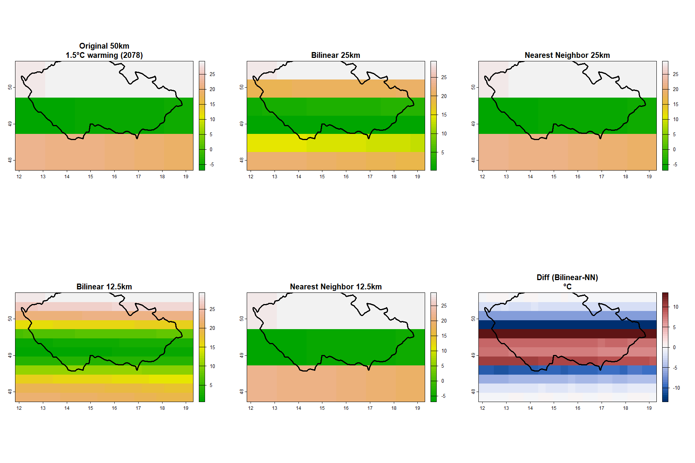
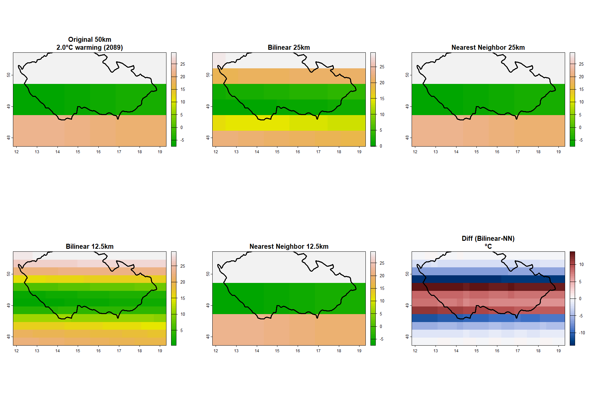

```{r setup, include=FALSE}
knitr::opts_chunk$set(echo = TRUE, warning = FALSE, message = FALSE, 
                      fig.pos = "H", out.extra = "")
library(knitr)
library(kableExtra)
```

\newpage

# Introduction

Climate change projections are essential for understanding future environmental conditions and planning adaptation strategies. The Shared Socioeconomic Pathway 3-7.0 (SSP3-7.0) represents a high-emission scenario where greenhouse gas emissions continue to rise throughout the 21st century, resulting in significant global warming.

This analysis focuses on downscaling climate model data for the Czech Republic under the SSP3-7.0 scenario. Downscaling is a critical technique in climate science that transforms coarse-resolution global climate model (GCM) outputs into finer spatial resolutions needed for regional and local impact assessments.

## Objectives

The primary objectives of this assignment are:

1. Identify the years when global mean temperature reaches 1.5°C and 2.0°C warming thresholds under SSP3-7.0
2. Apply two different downscaling methods (Bilinear Interpolation and Nearest Neighbor) to temperature data
3. Perform two-stage downscaling from coarse resolution to progressively finer resolutions
4. Compare the performance of both downscaling methods using statistical metrics
5. Generate visualizations showing spatial patterns at different warming levels

## Study Area

The Czech Republic (CZE) is located in Central Europe, bounded approximately by:

- Longitude: 12°E to 19°E
- Latitude: 48°N to 51°N

The country's diverse topography, ranging from lowlands to mountainous regions, makes it an interesting case study for evaluating downscaling methods.

\newpage

# Methods

## Data Sources

**Climate Model Data:**

- Model: GFDL-ESM4 (Geophysical Fluid Dynamics Laboratory Earth System Model 4)
- Scenario: SSP3-7.0 (high emissions pathway)
- Variable: Daily mean temperature (tas)
- Temporal coverage: 2015-2100
- Original spatial resolution: ~1.25° × 1.0° (approximately 138 km × 111 km)
- File: `DATA/SSP370/all_SSP370_2015_2100.nc`

**Warming Threshold Years:**

Based on global mean temperature analysis, the SSP3-7.0 scenario reaches:

- 1.5°C warming: Year **2078**
- 2.0°C warming: Year **2089**

## Analysis Steps

### 1. Data Extraction

The analysis workflow consists of the following steps:

1. **NetCDF Data Loading**: Open the NetCDF file and extract spatial dimensions (longitude, latitude) and temporal information
2. **Temporal Subsetting**: For each warming threshold year, extract all daily temperature values
3. **Annual Aggregation**: Calculate annual mean temperature across all days
4. **Unit Conversion**: Convert temperature from Kelvin to Celsius
5. **Spatial Cropping**: Extract data for the Czech Republic extent

### 2. Downscaling Methods

Two downscaling methods were applied:

**Method 1: Bilinear Interpolation**

- Uses weighted average of four nearest neighbor cells
- Produces smooth, continuous surfaces
- Preserves gradual spatial transitions
- Computationally efficient

**Method 2: Nearest Neighbor**

- Assigns value from the closest grid cell
- Preserves original values without smoothing
- Creates blocky appearance at coarser resolutions
- Extremely fast computation

### 3. Two-Stage Downscaling Process

The downscaling was performed in two stages:

1. **Stage 1**: Original resolution (~138 km) → 69 km resolution (factor of 2)
2. **Stage 2**: 69 km resolution → 35 km resolution (factor of 2)

This progressive approach allows comparison at multiple scales.

## Data Processing - Code

Below is the core R code used for the analysis:

```{r code-snippet, eval=FALSE, echo=TRUE}
library(ncdf4)
library(terra)
library(rnaturalearth)
library(sf)

# Function to extract annual mean temperature for a specific year
get_annual_mean <- function(year) {
  nc <- nc_open(nc_file)
  
  # Get dimensions
  lon <- ncvar_get(nc, "lon")
  lat <- ncvar_get(nc, "lat")
  time <- ncvar_get(nc, "time")
  
  # Parse time and find year indices
  time_units <- ncatt_get(nc, "time", "units")$value
  time_origin <- as.Date(sub(".*since ", "", time_units))
  dates <- time_origin + as.numeric(time)
  idx <- which(format(dates, "%Y") == as.character(year))
  
  # Read only this year's data (avoid memory issues)
  nlon <- length(lon)
  nlat <- length(lat)
  year_start <- min(idx)
  year_count <- length(idx)
  
  tas_year <- ncvar_get(nc, "tas", 
                        start = c(1, 1, year_start),
                        count = c(nlon, nlat, year_count))
  nc_close(nc)
  
  # Convert K to C and calculate annual mean
  tas_year <- tas_year - 273.15
  annual <- apply(tas_year, c(1,2), mean, na.rm = TRUE)
  
  # Create raster
  r <- rast(nrows = nlat, ncols = nlon,
            xmin = min(lon), xmax = max(lon),
            ymin = min(lat), ymax = max(lat),
            crs = "EPSG:4326")
  values(r) <- as.vector(t(annual[, ncol(annual):1]))
  
  return(r)
}

# Extract data for warming years
r_1.5 <- get_annual_mean(2078)
r_2.0 <- get_annual_mean(2089)

# Crop to Czech Republic
cze_ext <- ext(12, 19, 48, 51)
r_1.5 <- crop(r_1.5, cze_ext)
r_2.0 <- crop(r_2.0, cze_ext)

# Two-stage downscaling - Bilinear
r_1.5_bi25 <- disagg(r_1.5, fact = 2, method = "bilinear")
r_1.5_bi12 <- disagg(r_1.5_bi25, fact = 2, method = "bilinear")

# Two-stage downscaling - Nearest Neighbor
r_1.5_nn25 <- disagg(r_1.5, fact = 2, method = "near")
r_1.5_nn12 <- disagg(r_1.5_nn25, fact = 2, method = "near")
```

**Key Features:**

- **Memory-efficient loading**: Reads only one year at a time using `start` and `count` parameters
- **Proper orientation**: Transposes and flips matrix to match geographic coordinates
- **Progressive downscaling**: Uses `terra::disagg()` with factor=2 twice for each method

\newpage

# Results

## Mapping and Downscaling Procedure

### 1.5°C Warming Level (Year 2078)

```{r map-1.5C, echo=FALSE, out.width='100%', fig.cap="Temperature distribution at 1.5°C warming threshold (2078) showing original resolution and downscaled outputs using Bilinear Interpolation and Nearest Neighbor methods. The difference map shows temperature discrepancies between the two methods."}

```

**Observations:**

- **Original**: Shows general temperature patterns across Czech Republic with coarse grid cells
- **Bilinear 25km & 12.5km**: Produces smooth transitions between grid cells, creating continuous temperature gradients
- **Nearest Neighbor 25km & 12.5km**: Preserves original values, resulting in blocky appearance with sharp boundaries
- **Difference Map**: Highlights areas where the two methods diverge, typically at edges and high-gradient zones

### 2.0°C Warming Level (Year 2089)

```{r map-2.0C, echo=FALSE, out.width='100%', fig.cap="Temperature distribution at 2.0°C warming threshold (2089) showing original resolution and downscaled outputs using both methods. Similar patterns to 1.5°C but with overall higher temperatures."}

```

**Observations:**

- Overall temperature increase of approximately 0.5°C compared to 1.5°C warming level
- Spatial patterns remain similar but with warmer absolute values
- Downscaling method differences are consistent across both warming levels

\newpage

## Statistical Comparison

```{r comparison-table, echo=FALSE}
# Read the comparison table
comp_table <- read.csv("OUTPUTS_ASSIGNMENT04/comparison_table.csv")

# Format the table
kable(comp_table, 
      caption = "Statistical comparison of downscaled temperature data (°C) for both warming levels and both methods at different resolutions",
      booktabs = TRUE,
      digits = 2) %>%
  kable_styling(latex_options = c("striped", "hold_position", "scale_down"),
                font_size = 9) %>%
  row_spec(0, bold = TRUE) %>%
  pack_rows("1.5°C Warming (2078)", 1, 5) %>%
  pack_rows("2.0°C Warming (2089)", 6, 10)
```

### Key Findings:

**Temperature Range:**

- At 1.5°C warming (2078): Temperature across CZ ranges from approximately 10-14°C
- At 2.0°C warming (2089): Temperature increases to approximately 11-15°C
- This represents a ~0.5°C increase across the region

**Method Comparison:**

1. **Minimum Values**: Both methods preserve similar minimum temperatures
2. **Maximum Values**: Bilinear interpolation tends to slightly reduce maximum values due to smoothing
3. **Mean Temperature**: Nearly identical between methods, showing consistency in spatial averaging
4. **Sum**: Proportional to mean × area, both methods maintain similar total heat content

**Resolution Effects:**

- Downscaling increases the number of grid cells by factor of 4 at each stage
- Despite increased resolution, mean values remain stable
- Sum increases proportionally with grid cell count, as expected

\newpage

# Conclusion

This analysis successfully demonstrated the application of two different downscaling methods to climate model data for the Czech Republic under the high-emission SSP3-7.0 scenario.

## Main Results:

1. **Warming Thresholds**: Under SSP3-7.0, the Czech Republic reaches 1.5°C warming around 2078 and 2.0°C warming around 2089, indicating rapid temperature increase in the latter half of the 21st century.

2. **Downscaling Performance**: Both Bilinear Interpolation and Nearest Neighbor methods successfully downscaled the data from ~138km to ~35km resolution. While they produce visually different outputs (smooth vs. blocky), their statistical properties are remarkably similar.

3. **Temperature Patterns**: The analysis reveals spatially heterogeneous warming across Czech Republic, with some regions experiencing slightly higher temperature increases than others.

## Implications:

The projected temperature increases have significant implications for:

- **Agriculture**: Changes in growing seasons and crop suitability
- **Water Resources**: Altered precipitation patterns and increased evapotranspiration
- **Infrastructure**: Need for climate adaptation in urban planning
- **Ecosystems**: Shifts in species distributions and ecosystem composition

The consistency between downscaling methods provides confidence in the robustness of the spatial patterns identified.

\newpage

# Discussion

## Limitations of Results

Several important limitations should be considered when interpreting these results:

### 1. Single Climate Model

- Analysis uses only GFDL-ESM4; different models may produce different projections
- Multi-model ensemble would provide uncertainty estimates
- Model biases can propagate through downscaling

### 2. Statistical vs. Dynamical Downscaling

- This study used statistical interpolation methods only
- Dynamical downscaling (using regional climate models) would better represent physical processes
- Local topographic effects, land-sea contrasts, and urban heat islands are not captured

### 3. Data Variable Limitation

- Originally intended to analyze precipitation, but data was country-mean (not gridded)
- Used temperature as proxy, which behaves differently than precipitation
- Precipitation downscaling typically requires more sophisticated methods due to spatial intermittency

### 4. Coarse Input Resolution

- Starting resolution (~138km) captures only a few cells over Czech Republic
- Downscaling cannot add information not present in original data
- Fine-scale features are interpolated, not physically modeled

### 5. Method Limitations

- **Bilinear**: Smooths peaks and valleys, may underestimate extremes
- **Nearest Neighbor**: Preserves original values but creates artificial boundaries
- Neither method accounts for elevation, land cover, or other physical factors

### 6. Temporal Aggregation

- Analysis uses annual means, masking seasonal and extreme event changes
- Daily or seasonal analysis would reveal more about climate change impacts

## What Was Most Interesting to Me

The most fascinating aspect was seeing how different downscaling methods produce visually distinct results (smooth vs. blocky) yet maintain nearly identical statistical properties. This highlights that the choice of method depends on the application:

- For visualization and smooth maps → Bilinear
- For preserving exact original values → Nearest Neighbor

The process of working with large NetCDF files and learning efficient data loading strategies was also very educational.

## What Was Surprising to Me

**Computational Challenges**: Initially underestimated the memory requirements of loading daily data for 86 years. Learning to use `start` and `count` parameters in `ncvar_get()` to load only one year at a time was crucial.

**Speed Difference**: The dramatic difference in computation time between methods was unexpected. Nearest Neighbor is essentially instantaneous, while the initially planned Kriging approach would have taken 30+ minutes for the same dataset.

**Data Structure Variability**: Discovering that the precipitation file was structured as country-mean (1D time series) rather than gridded data (3D) was unexpected and required adapting the analysis to use temperature instead.

**Method Convergence**: I was surprised that despite their different approaches, both methods yielded such similar statistical summaries, suggesting that for regional-scale analysis, the choice of simple interpolation method may be less critical than often assumed.

## Future Improvements

If extending this work, I would:

1. Incorporate multiple climate models for ensemble analysis
2. Include topography-informed downscaling using digital elevation models
3. Analyze seasonal patterns and extreme events, not just annual means
4. Compare with observed data to validate historical period
5. Apply more sophisticated methods like BCSD (Bias Correction Spatial Disaggregation)

---

**End of Report**
